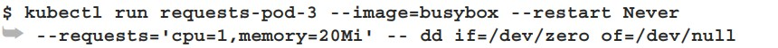
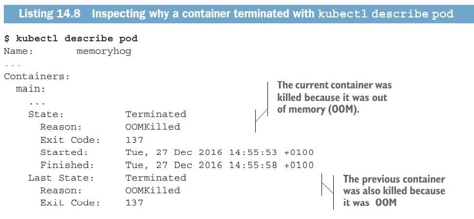

# Managing pods’ computational resources

## Requesting resources for a pod’s containers

When creating a pod, you can specify the amount of CPU and memory that a container needs (these are called requests) and a hard limit on what it may consume (known as limits). They’re specified for each container individually, not for the pod as a whole. The pod’s resource requests and limits are the sum of the requests and limits of all its containers.

In the pod manifest, your single container requires one-fifth of a CPU core (200 millicores) to run properly. Five such pods/containers can run sufficiently fast on a single CPU core.

In the pod spec, you’re also requesting 10 mebibytes of memory for the container.

The **dd** command you’re running in the container consumes as much CPU as it can, but it only runs a single thread so it can only use a single core. The  VM, which is where this example is running, has two CPU cores allotted to it. That’s why the process is shown consuming 50% of the whole CPU. 

By specifying resource requests, you’re specifying the minimum amount of resources your pod needs. 

If the amount of unallocated CPU or memory is less than what the pod requests, Kubernetes will not schedule the pod to that node, because the node can’t provide the minimum amount required by the pod.

Two prioritization functions rank nodes based on the amount of resources requested: **LeastRequestedPriority** and **MostRequestedPriority**. The first one prefers nodes with fewer requested resources (with a greater amount of unallocated resources), whereas the second one is the exact opposite—it prefers nodes that have the most requested resources (a smaller amount of unallocated CPU and memory).

In the previous example, the node  runs in a VM with two cores and has no CPU reserved, making the whole CPU allocatable to pods. Therefore, the Scheduler should have no problem scheduling another pod requesting 800 millicores. 

You now have two pods deployed, which together have requested a total of 1,000 millicores or exactly 1 core.

If you delete your second pod, the Scheduler will be notified of the deletion and will schedule your third pod as soon as the second pod terminates.

The CPU requests don’t only affect scheduling—they also determine how the remaining (unused) CPU time is distributed between pods. Because your first pod requested 200 millicores of CPU and the other one 1,000 millicores, any unused CPU will be split among the two pods in a 1 to 5 ratio, as shown in figure 14.2. If both pods consume as much CPU as they can, the first pod will get one sixth or 16.7% of the CPU time and the other one the remaining five sixths or 83.3%.

But if one container wants to use up as much CPU as it can, while the other one is sitting idle at a given moment, the first container will be allowed to use the whole CPU time.

Defining and requesting custom resources.

Unlike resource requests, resource limits aren’t constrained by the node’s allocatable resource amounts. The sum of all limits of all the pods on a node is allowed to exceed 100% of the node’s capacity (figure 14.3).

When a process tries to allocate memory over its limit, the process is killed (it’s said the container is **OOM** Killed, where **OOM** stands for **Out Of Memory**). If the pod’s restart policy is set to **Always** or **OnFailure**, the process is restarted immediately, so you may not even notice it getting killed. But if it keeps going over the memory limit and getting killed, **Kubernetes** will begin restarting it with increasing delays between restarts.

The **CrashLoopBackOff** status doesn’t mean the Kubelet has given up. It means that after each crash, the Kubelet is increasing the time period before restarting the container.

The **OOMKilled** status tells you that the container was killed because it was out of memory. In the previous listing, the container went over its memory limit and was killed immediately.

It’s important not to set memory limits too low if you don’t want your container to be killed. But containers can get OOMKilled even if they aren’t over their limit. 

**CONTAINERS ALWAYS SEE THE NODE’S MEMORY, NOT THE CONTAINER’S.**

**CONTAINERS ALSO SEE ALL THE NODE’S CPU CORES.**

## Understanding pod QoS classes

Imagine having two pods, where pod A is using, let’s say, 90% of the node’s memory and then pod B suddenly requires more memory than what it had been using up to that point and the node can’t provide the required amount of memory. Which   container should be killed?

Kubernetes can’t make a proper decision on its own. You need a way to specify which pods have priority in such cases. Kubernetes does this by categorizing pods into three **Quality of Service (QoS)** classes:
- **BestEffort (the lowest priority)**
- **Burstable**
- **Guaranteed (the highest)**

The lowest priority QoS class is the BestEffort class. It’s assigned to pods that don’t have any requests or limits set at all (in any of their containers). 

On the other end of the spectrum is the Guaranteed QoS class. This class is given to pods whose containers’ requests are equal to the limits for all resources. For a pod’s class to be Guaranteed, three things need to be true:
- **Requests and limits need to be set for both CPU and memory.**
- **They need to be set for each container.**
- **They need to be equal (the limit needs to match the request for each resource in each container).**

In between BestEffort and Guaranteed is the Burstable QoS class. All other pods fall into this class.

FIGURING OUT THE QOS CLASS OF A POD WITH MULTIPLE CONTAINERS.

When the system is overcommitted, the QoS classes determine which container gets killed first so the freed resources can be given to higher priority pods. First in line to get killed are pods in the BestEffort class, followed by Burstable pods, and finally Guaranteed pods, which only get killed if system processes need memory.

## Introducing the **LimitRange** resource

It’s a good idea to set requests and limits on every container. Instead of having to do this for every container, you can also do it by creating a **Limit-Range** resource.

## Introducing the ResourceQuota object

A **ResourceQuota** limits the amount of computational resources the pods and the amount of storage **PersistentVolumeClaims** in a namespace can consume. It can also limit the number of pods, claims, and other API objects users are allowed to create inside the namespace.

A **ResourceQuota** object applies to the namespace it’s created in, like a **Limit-Range**, but it applies to all the pods’ resource requests and limits in total and not to each individual pod or container separately, as shown in figure 14.7.

A **ResourceQuota** object can also limit the amount of persistent storage that can be claimed in the namespace.

In this example, the amount of storage all **PersistentVolumeClaim**s in a namespace can request is limited to **500 GiB** (by the **requests.storage** entry in the **ResourceQuota** object). But  **PersistentVolumeClaims** can request a dynamically provisioned **PersistentVolume** of a specific **StorageClass**. That’s why Kubernetes also makes it possible to define storage quotas for each **StorageClass** individually. The previous example limits the total amount of claimable **SSD storage** (designated by the **ssd StorageClass**) to **300 GiB**. The less-performant **HDD storage** (**StorageClass standard**) is limited to **1 TiB**.

##  Limiting the number of objects that can be created

A ResourceQuota can also be configured to limit the number of Pods, Replication-Controllers, Services, and other objects inside a single namespace. This allows the cluster admin to limit the number of objects users can create based on their payment or example, and can also limit the number of public IPs or node ports Services can use. 

Object count quotas can currently be set for the following objects: 
- Pods
- ReplicationControllers 
- Secrets
- ConfigMaps
- PersistentVolumeClaims
- Services (in general), and for two specific types of Services, such as LoadBalancer Services (services.loadbalancers) and NodePort Services (services.nodeports)
  